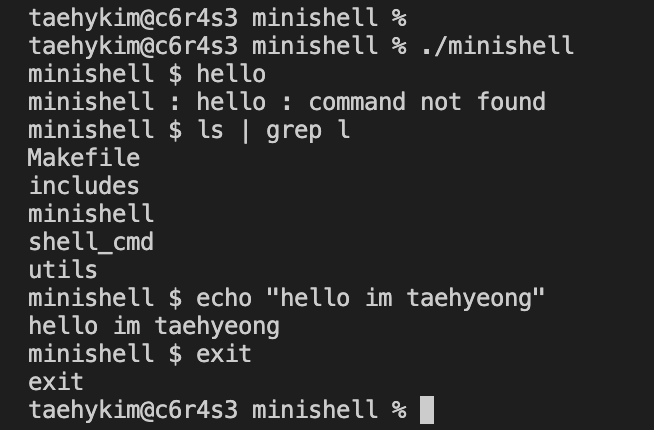

# minishell (참여: taehykim, wonjchoi)
42Seoul Project

 
Bash 모방 프로그램 개발. shell command 구현  
참고자료 : [bash manual](https://www.gnu.org/savannah-checkouts/gnu/bash/manual/) 

|구현 기능|
|:-:|
|echo [-n] text|
|cd|
|cat|
|heredoc|
|export|
|unset|
|env|
|exit|
|$""|
|''|
| pipes : \| |
|redirection : <, >, <<, >>|
|$"(ENVP_NAME)"|
|' '|
|$?|
|ctrl-C, ctrl-D, ctrl-\|
|ls, pwd, cd, etc|
 

 
